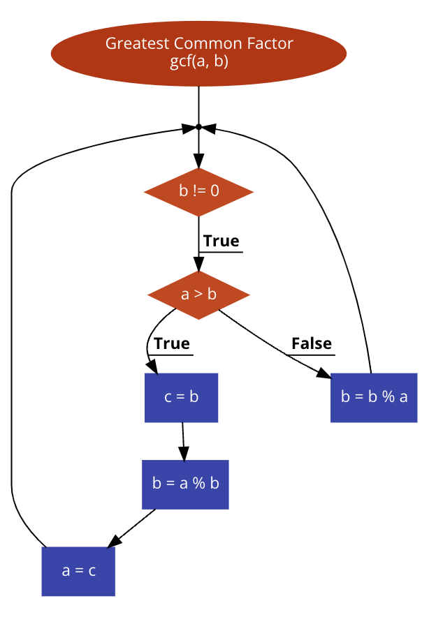

# Java-Assignment-007

Java Assignment 7 - Greatest Common Factor

## Euclid's GCF Algorithm Explained
<iframe width="560px" height="320px" allowfullscreen="true" allow="autoplay *" title="Euclid_GCF" src="https://redwoods.us-west-2.instructuremedia.com/embed/a9ac7a12-f15a-41e3-a1ec-fbe21bcc3ab6" frameborder="0"></iframe>

## Flowchart of Euclid's GCF Algorithm

## PART 1: Implement a gcf method in MyMath class
* Use the flowchart above to implement a method **gcf** in the **MyMath** class that calculates the greatest common factor of 2 numbers.
    * Hint 1: This flowchart depicts a while loop and conditional

## PART 2: Turn In

* Make sure to use the Git tab at the bottom of IntelliJ to create a Fall_2022 feature branch
* Commit and Push your running code back to your GitHub account
* Issue a Pull request back to my Java-Assignment-007 repo
* Cut and Paste the Pull request URL into your Canvas assignment to turn it in.
